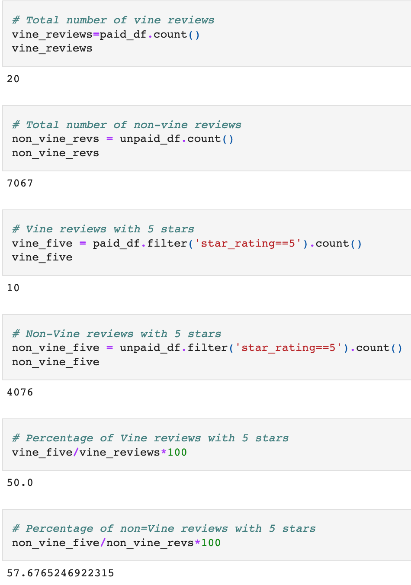

# Amazon_Vine_Analysis
## Overview of the analysis
The purpose of this analysis is to analyze a dataset, perform the ETL process and then determine if there is any bias in the dataset.

## Results
I chose the jewelry dataset from the Amazon Vine program. I used PySpark to perform the ETL process to extract the dataset, transform the data, connect to an AWS RDS instance, and load the transformed data into pgAdmin. The using PySpark, I analyzed the data determine if there is any bias toward favorable reviews from Vine members in the dataset.

#### How many Vine reviews and non-Vine reviews were there?
There were 20 Vine reviews and 7067 non-Vine reviews.

#### How many Vine reviews were 5 stars? How many non-Vine reviews were 5 stars?
10 Vine reviews were 5 stars and 4076 non-Vine reviews were 5 stars.

#### What percentage of Vine reviews were 5 stars? What percentage of non-Vine reviews were 5 stars?
50% of the Vine reviews were 5 stars and 57.68% of the non-Vine reviews were 5 stars.

## Summary:
There is not positivity bias for the reviews in the Vine program as the data is now. The percentages between the Vine reviews and the non-Vine reviews are similar, with only a 7% difference. There is a need for more data for Vine reviews as there were only 20 Vine reviews compared to the 7067 non-Vine reviews, which would us a better picture. Another analysis that can be run, is instead of filtering the data, leave all the votes in the dataset and run the review analysis on the original data and see if the percentages change.  

